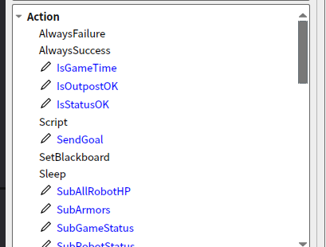

### 2024赛季哨兵决策部分代码
#### 介绍
参考[深北莫北极熊开源](https://gitee.com/SMBU-POLARBEAR/rm_behavior_tree)，部分有改动（分区赛版本）
#### 代码框架
└──rm_decision_ws
   ├──BehaviorTree.ROS2
   ├── rm_behavior_tree
   |   ├──CMakeLists.txt
   |   ├──package.xml
   |   ├──config
   |   |  └──rmuc.xml
   |   ├──include
   |      ├──plugins
   |         ├──action
   |         ├──condition
   |         └──decorator
   |      ├──bt_conversions.hpp
   |      └──rm_behavior_tree.h
   |    ├──launch
   |      └──rm_behavior_tree.launch.py
   |   ├──plugins
   |      ├──action
   |      ├──condition
   |      └──decorator
   |   └──src
   |      └──rm_behavior_tree.cpp
   └──rm_decision_interfaces
      ├──msg
      ├──CMakeLists.txt
      ├──package.xml
      └──publish_script.sh
#### 环境配置
 Ubuntu22.04, ROS2 humble, [BehaviorTree.CPP 4.5](https://github.com/BehaviorTree/BehaviorTree.ROS2), [Groot2](https://github.com/BehaviorTree/Groot2)
##### 资料
 [官网教程](https://www.behaviortree.dev/docs/tutorial-basics/tutorial_11_groot2/)
 [鱼香ros教程](https://fishros.org.cn/forum/topic/354/ros2%E4%B8%AD%E7%9A%84%E8%A1%8C%E4%B8%BA%E6%A0%91-behaviortree)
 [代码示例](https://github.com/BehaviorTree/BehaviorTree.ROS2/tree/humble/btcpp_ros2_samples)
##### 安装
'''
sudo apt install ros-humble-behaviortree-cpp
git clone https://gitee.com/SMBU-POLARBEAR/rm_behavior_tree.git
cd rm_behavior_tree
colcon build --symlink-install --cmake-args -DCMAKE_EXPORT_COMPILE_COMMANDS=ON
'''
#### 说明
1. BehaviorTree.ROS2 navigation2引入的开源c++行为树库,行为树使用树状结构，可使用groot2进行可视化
2. rm_behavior_tree 
- config中的xml文件用于描述行为树逻辑结构,可使用groot2生成，groot2中的节点插件需要自行添加并设置(蓝色为自行添加)，节点逻辑含义可自行搜索或[查看官网教程](https://www.behaviortree.dev/docs/nodes-library/DecoratorNode)

- include中plugins为树节点类型,,groot2中添加节点后在对应节点类型文件夹中添加头文件,同时需要修改rm_behavior_tree.cpp、CMakeLists.txt,有时需修改package.xml
- launch中rm_behavior_tree.launch.py为启动文件
- plugins中为各节点类型对应C++文件，需自行添加
3. rm_decision_interfaces
- msg中为关于裁判系统的自定义消息类型,根据需求自行删改
